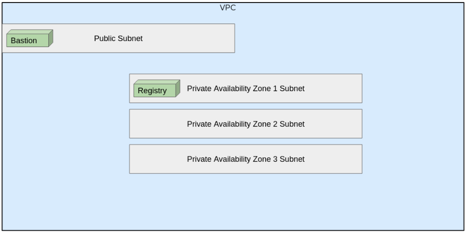

# Installing OpenShift in Disconnected AWS GovCloud using IPI


## Overview

This guide is intended to demonstrate how to perform the OpenShift installation using the IPI method on AWS GovCloud. In addition, the guide will walk through performing this installation on an existing disconnected network. In other words the network does not allow access to and from the internet.

## YouTube Video

A video that walks through this guide is available here: https://youtu.be/bHmcWHF-sEA

## AWS Configuration Requirements for Demo
<figure>
  
  <figcaption>Image: Demo VPC Drawing</figcaption>
  <p></p>
</figure>
   
   

In this guide, we will install OpenShift onto an existing AWS GovCloud VPC. This VPC will contain three private subnets that have no connectivity to the internet, as well as a public subnet that will facilitate our access to the private subnets from the internet (bastion). We still need to allow access to the AWS APIs from the private subnets. For this demo, that AWS API communication is facilitated by a squid proxy. Without that access, we will not be able to install a cloud aware OpenShift cluster. 

A Cloud Formation template that details the VPC with squid proxy used in this demo can be found [**here**](https://github.com/dmc5179/openshift4-disconnected/blob/master/cloudformation/disconnected_vpc/disconnected_vpc.yaml). This demo assumes these are provided, but this template may be leveraged to create these resources if desired.


This guide will assume that the user has valid accounts and subscriptions to both Red Hat OpenShift and AWS GovCloud.
#
## Installing OpenShift 

### Create OpenShift Installation Bundle
1. Download and compress the bundle on internet connected machine using the OpenShift4-mirror companion utility found [**here**](https://repo1.dso.mil/platform-one/distros/red-hat/ocp4/openshift4-mirror)
   

   You will first need to retrieve an OpenShift pull secret. Once you have retrieved that, enter it into the literals of the value for `--pull-secret` in the command below. Pull secrets can be obtained from https://cloud.redhat.com/openshift/install/aws/installer-provisioned

    ```
    podman run -it --security-opt label=disable -v ./:/app/bundle quay.io/redhatgov/openshift4_mirror:latest \
      ./openshift_mirror bundle \
      --openshift-version 4.7.0 \
      --platform aws \
      --skip-existing \
      --skip-catalogs \
      --pull-secret '{"auths":{"cloud.openshift.com":{"auth":"b3Blb...' && \
    git clone https://repo1.dso.mil/platform-one/distros/red-hat/ocp4/documentation.git ./4.7.0/ocp-disconnected && \
    tar -zcvf openshift-4-7-0.tar.gz 4.7.0
    ```
2. Transfer bundle from internet connected machine to disconnected vpc host.

#
### Prepare and Deploy
3. Extract bundle on disconnected vpc host.
    ```    
    tar -xzvf openshift-4-7-0.tar.gz
    ```

4. Create S3 Bucket and attach policies.

    ```
    export awsreg=$(aws configure get region)
    export s3name=$(date +%s"-rhcos")
    aws s3api create-bucket --bucket ${s3name} --region ${awsreg} --create-bucket-configuration LocationConstraint=${awsreg}
    aws iam create-role --role-name vmimport --assume-role-policy-document "file://4.7.0/ocp-disconnected/aws-gov-ipi-dis-maniam/trust-policy.json"
    envsubst < ./4.7.0/ocp-disconnected/aws-gov-ipi-dis-maniam/role-policy-templ.json > ./4.7.0/ocp-disconnected/aws-gov-ipi-dis-maniam/role-policy.json
    aws iam put-role-policy --role-name vmimport --policy-name vmimport --policy-document "file://4.7.0/ocp-disconnected/aws-gov-ipi-dis-maniam/role-policy.json"
    ```

5. Upload RHCOS Image to S3

    ```
    gzip -d ./4.7.0/rhcos/rhcos-47.83.202102090044-0-aws.x86_64.vmdk.gz
    aws s3 mv ./4.7.0/rhcos/rhcos-47.83.202102090044-0-aws.x86_64.vmdk s3://${s3name}
    ```

6. Create AMI

    ```
    envsubst < ./4.7.0/ocp-disconnected/aws-gov-ipi-dis-maniam/containers-templ.json > ./4.7.0/ocp-disconnected/containers.json
    taskid=$(aws ec2 import-snapshot --region ${awsreg} --description "rhcos-snapshot" --disk-container file://4.7.0/ocp-disconnected/containers.json | jq -r '.ImportTaskId')
    until [[ $resp == "completed" ]]; do sleep 2; echo "Snapshot progress: "$(aws ec2 describe-import-snapshot-tasks --region ${awsreg} | jq --arg task "$taskid" -r '.ImportSnapshotTasks[] | select(.ImportTaskId==$task) | .SnapshotTaskDetail.Progress')"%"; resp=$(aws ec2 describe-import-snapshot-tasks --region ${awsreg} | jq --arg task "$taskid" -r '.ImportSnapshotTasks[] | select(.ImportTaskId==$task) | .SnapshotTaskDetail.Status'); done
    snapid=$(aws ec2 describe-import-snapshot-tasks --region ${awsreg} | jq --arg task "$taskid" '.ImportSnapshotTasks[] | select(.ImportTaskId==$task) | .SnapshotTaskDetail.SnapshotId')
    aws ec2 register-image \
      --region ${awsreg} \
      --architecture x86_64 \
      --description "rhcos-47.83.202102090044-0-aws.x86_64" \
      --ena-support \
      --name "rhcos-47.83.202102090044-0-aws.x86_64" \
      --virtualization-type hvm \
      --root-device-name '/dev/xvda' \
      --block-device-mappings 'DeviceName=/dev/xvda,Ebs={DeleteOnTermination=true,SnapshotId='${snapid}'}' 
    ```

7. Record the AMI ID from the output of the above command.

8. Create registry cert on disconnected vpc host
    ```
    export SUBJ="/C=US/ST=Virginia/O=Red Hat/CN=${HOSTNAME}"
    openssl req -newkey rsa:4096 -nodes -sha256 -keyout registry.key -x509 -days 365 -out registry.crt -subj "$SUBJ"
    ```    

9. Make a copy of the install config
    ```
    mkdir ./4.7.0/config
    cp ./4.7.0/ocp-disconnected/aws-gov-ipi-dis-maniam/install-config-template.yaml ./4.7.0/config/install-config.yaml
    ```
10. Edit install config
    For this step, Open `./4.7.0/config/install-config.yaml` and edit the following fields:

    ```
    baseDomain: i.e. example.com
    additionalTrustBundle: copy and paste the content of ./registry.crt here.
    imageContentSources:
      mirrors: Only edit the registry hostname fields of this section. Make sure that you use the $HOSTNAME of the devices that you are currently using.
    metadata:
      name: i.e. test-cluster
    networking:
      machineNetwork:
      - cidr: i.e. 10.0.41.0/20. Shorten or lengthen this list as needed.
    platform:
      aws:
        region: the default region of your configured aws cli 
        zones: A list of availability zones that you are deploying into. Shorten or lengthen this list as needed.
        subnets: i.e. subnet-ef12d288. The length of this list must match the .networking.machineNetwork[].cidr length.
        amiID: the AMI ID recorded from step 9
        pullSecret: your pull secret enclosed in literals
        sshKey: i.e ssh-rsa AAAAB3... No quotes
    ```
    Don't forget to save and close the file!

11. Make a backup of the final config:
    ```
    cp -R ./4.7.0/config/ ./4.7.0/config.bak
    ```

12. Create manifests from install config.
    ```
    openshift-install create manifests --dir ./4.7.0/config
    ```

13. Delete the installer generated secret
    ```
    rm ./4.7.0/config/openshift/99_cloud-creds-secret.yaml 
    ```
14. create iam users and Policies

    ```
    cd ./4.7.0/ocp-disconnected/aws-gov-ipi-dis-maniam
    chmod +x ./ocp-users.sh
    ./ocp-users.sh prepPolicies
    ./ocp-users.sh createUsers
    ```

15. Use the convenience script to create the aws credentials and kubernetes secrets:
    ```
    chmod +x ./secret-helper.sh
    ./secret-helper.sh
    cp secrets/* ../../config/openshift/
    cd -
    ```

16. start up the registry in the background
    ```
    oc image serve --dir=./4.7.0/release/ --tls-crt=./registry.crt --tls-key=./registry.key &
    ```

17. Deploy the cluster

    ```
    openshift-install create cluster --dir ./4.7.0/config
    ```
#
### Cluster Access

You can now access the cluster via CLI with oc or the web console with a web browser.

18. Locate the OpenShift access information provided by the final installer output.

    Example:
    ```
    INFO Waiting up to 10m0s for the openshift-console route to be created... 
    INFO Install complete!                            
    INFO To access the cluster as the system:admin user when using 'oc', run 'export KUBECONFIG=/home/ec2-user/data/vid-pres/4.7.0/config/auth/kubeconfig' 
    INFO Access the OpenShift web-console here: https://console-openshift-console.apps.test-cluster.testocp1.net 
    INFO Login to the console with user: "kubeadmin", and password: "z9yDP-2M6DS-oE9Im-Dcdzk" 
    INFO Time elapsed: 48m34s    
    ```

19. Set the default kube context used by oc and kubectl:  

    Example:
    ```
    export KUBECONFIG=/home/ec2-user/data/vid-pres/4.7.0/config/auth/kubeconfig
    ```
20. Access the web console:

    URL Example:
    `https://console-openshift-console.apps.test-cluster.testocp1.net`

    Credentials Example:  
    ```
    INFO Login to the console with user: "kubeadmin", and password: "z9yDP-2M6DS-oE9Im-Dcdzk
    ```
